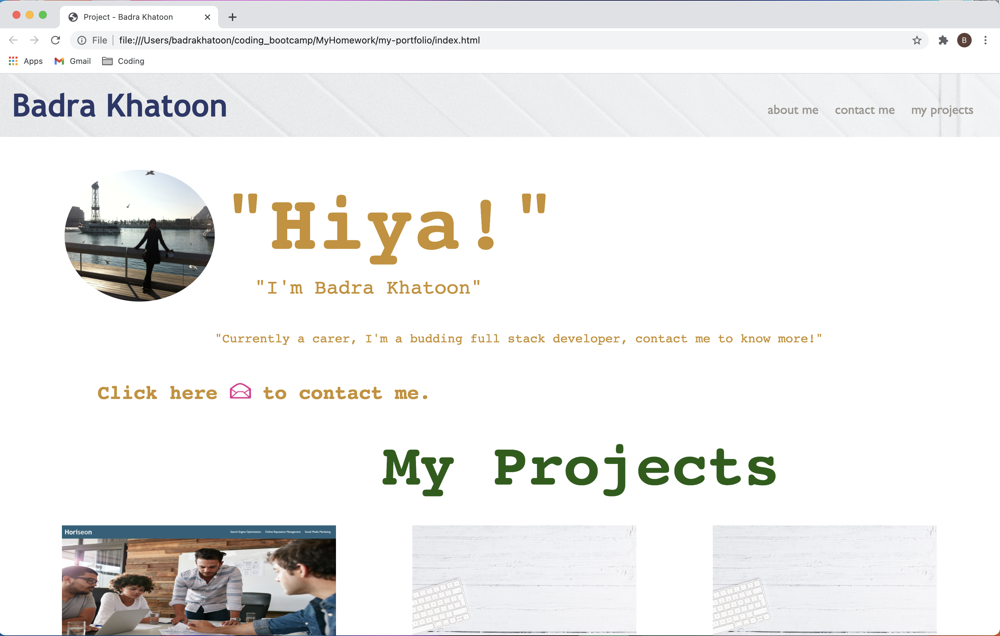
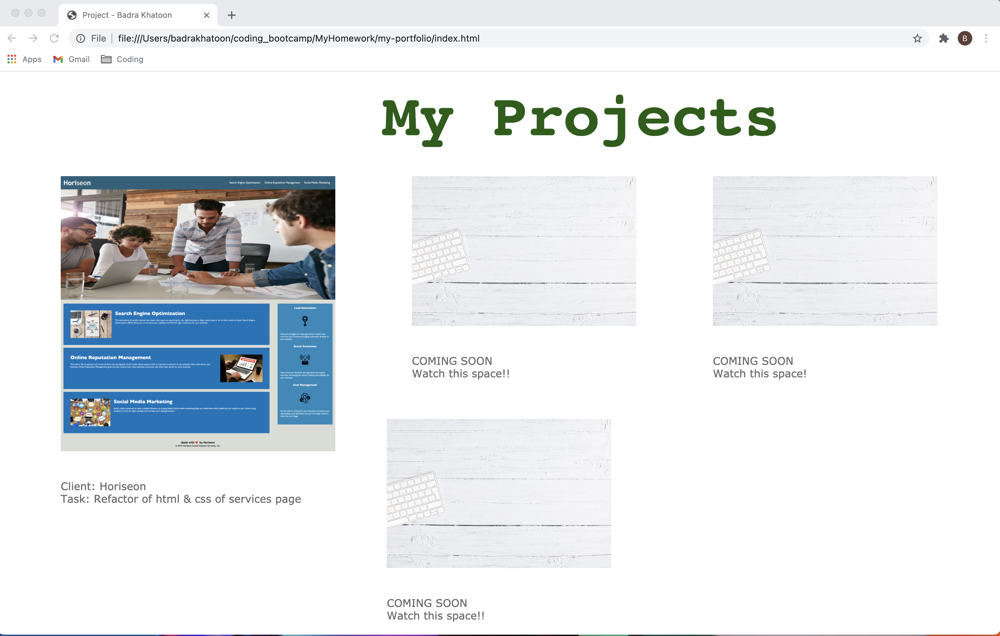

My Portfolio - Advanced CSS

Task: To create my portfolio page using both html and css.

Main actions:

1.  Firstly drafted a wireframe;
2.  Following BEM methodology, structured the initial html with anticipated classes recognising that these may have to change subject to the final portfolio page design;
3.  The portfolio comprises three sections: the header with navigation bar, the main section (a picture, about me and how to contact me) and my projects showcasing the projects completed thus far;
4.  The navbar is fully clickable to the appropriate sections;
5.  Added media queries and flex boxes for both tablet and mobile views to ensure each section is responsive;
6.  The projects section references a linked previous project to showcase current skills and additional space for future projects;
7.  Lastly worked on the various css design elements to showcase basic css and design knowledge.
8.  Added comments referencing the various sections in both html and css.
9.  All stages of the build can be viewed on GitHub which is linked below;

Please note screen shots of working website:

Image 1 to show top part of portfolio page. URL: 
Image 2 to show bottom part of portfolio page. URL: 

Link to deployed application:
file:///Users/badrakhatoon/coding_bootcamp/MyHomework/my-portfolio/index.html

Link to GitHub repository:
https://bkay1.github.io/my-portfolio/.
